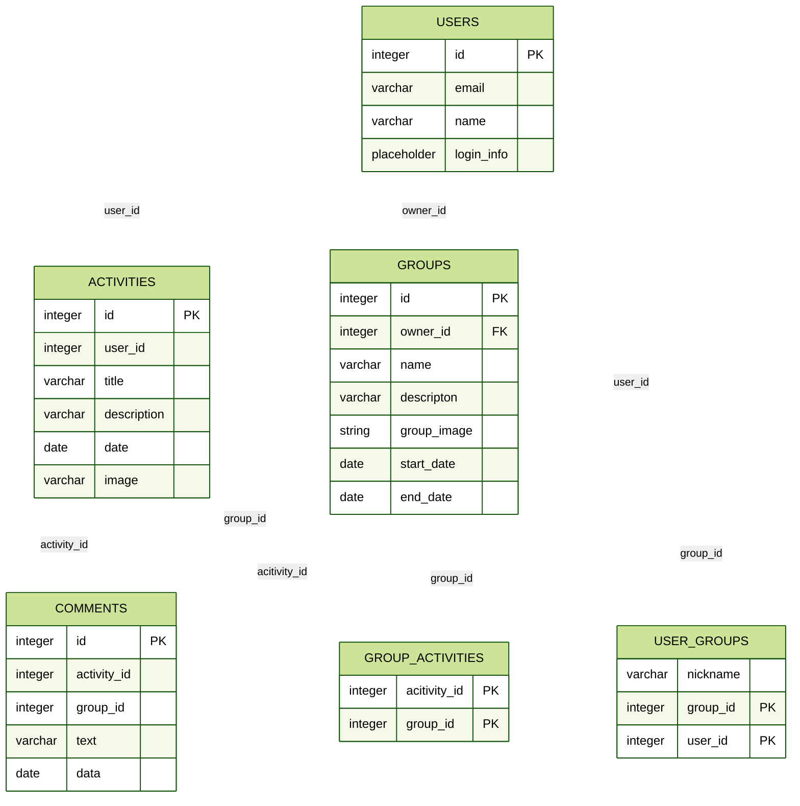
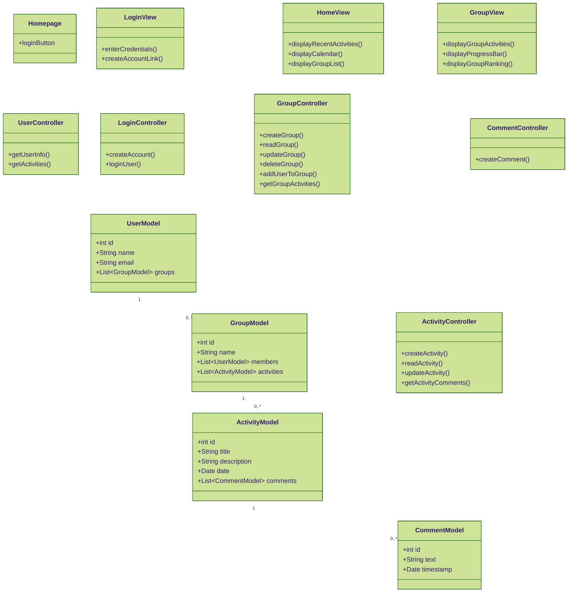

# CODECK
###### COmpetição DE Código do Kim 
GymRats para maratoners. Codar é legal, mas codar melhor que seus amigos é mais.

# Banco de dados
Utilizamos PostgreSQL para o banco de dados. 
## Diagrama de tabelas

# Diagrama de classes 

