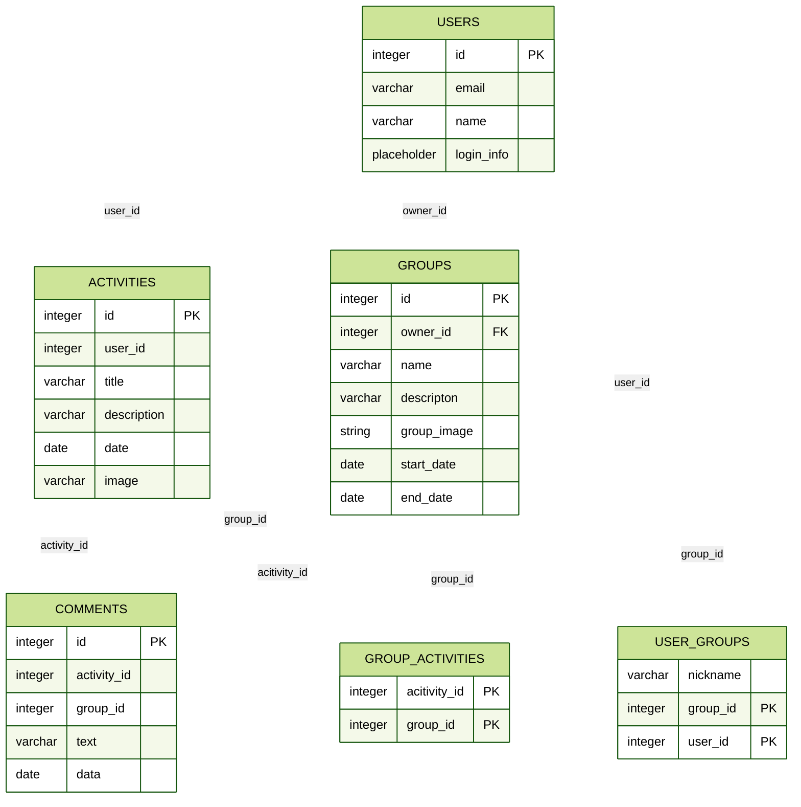
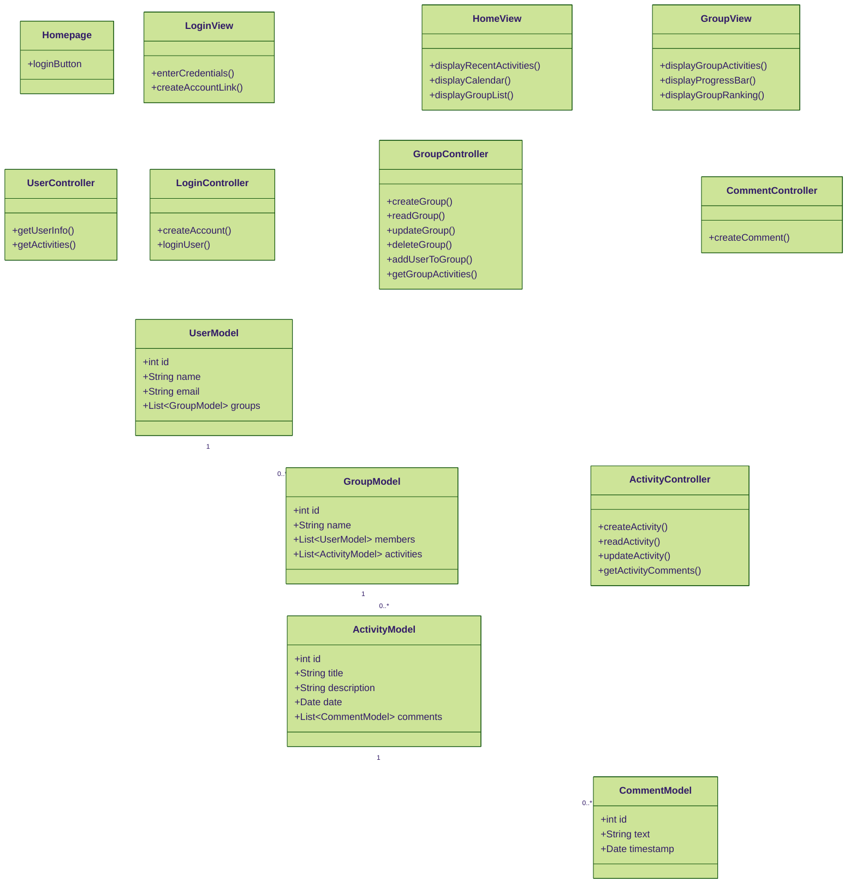

# CODECK

###### COmpetição DE Código do Kim

GymRats para maratonistas. Programar é legal, mas programar melhor que seus amigos é mais ainda.

## 🚀 Funcionalidades Implementadas

### ✅ Sistema de Feed de Atividades por Grupo

* **Grupos de Usuários**: Usuários podem criar e entrar em vários grupos
* **Feed de Atividades**: Veja as atividades de todos os grupos aos quais você pertence
* **Atividades por Grupo**: Visualize atividades específicas de grupos individuais
* **Filtro Inteligente**: As atividades são filtradas com base na associação a grupos

### ✅ Endpoints de API Completos

* `GET /users/{id}/groups` - Obtém os grupos de um usuário
* `GET /activities/feed?user_id={user_id}` - Obtém o feed de atividades de um usuário
* `POST /groups` - Cria grupos com o criador automaticamente adicionado
* `POST /activities` - Cria atividades vinculadas a grupos

### ✅ Integração com Frontend Moderno

* Frontend em **React + TypeScript** com componentes do Material-UI
* **Barra Lateral de Grupos** para navegação fácil entre grupos
* **Feed de Atividades** com visualizações de "Todos os Grupos" e de grupos individuais
* **Criação de Atividades** com seleção de grupo
* Comunicação entre frontend e backend com **API tipada com segurança**

## 📖 Começando

### Pré-requisitos

* Go 1.19 ou superior
* Node.js 18 ou superior
* npm ou yarn
* docker  
* docker compose 

### Instalação e Execução

```bash
# Iniciar o backend
cd backend
docker compose up --build

# Iniciar o frontend (em outro terminal)
cd frontend
npm install
npm start
```

Acesse `http://localhost:3000` para usar a aplicação!

### Testes

Execute os testes do backend usando Docker para isolamento completo:

```bash
cd backend
docker compose -f docker-compose.test.yml run --rm test_runner
```

Esse comando irá automaticamente:

* Iniciar um container limpo com banco de dados de teste
* Executar todos os testes com dados de teste isolados
* Remover os containers ao finalizar

Veja [backend/TESTING.md](backend/TESTING.md) para a documentação completa de testes.

# Banco de dados
Utilizamos PostgreSQL para o banco de dados. 
## Diagrama de tabelas

```mermaid
%%{init: {'theme': 'forest', 'themeVariables': {
    'primaryColor': '#ffcc00',
    'edgeLabelBackground':'#ffffff',
    'tertiaryColor': '#e0e0e0',
    'lineColor':'#ffffff'
}}}%%

erDiagram
    %% Tables Definition
    USERS {
      integer id PK
      varchar email
      varchar name
      placeholder login_info
    }
    ACTIVITIES {
      integer id PK
      integer user_id
      varchar title
      varchar description
      date date
      varchar image
    }
    COMMENTS {
      integer id PK
      integer activity_id
      integer group_id
      varchar text
      date data
    }
    GROUPS {
      integer id PK
      integer owner_id FK
      varchar name
      varchar descripton
      string group_image
      date start_date
      date end_date
    }
    USER_GROUPS {
      varchar nickname
      integer group_id PK
      integer user_id PK
    }
    GROUP_ACTIVITIES {
      integer acitivity_id PK
      integer group_id PK
    }

    %% Relationships (Foreign Keys)
    USERS ||--o{ ACTIVITIES : user_id
    USERS ||--o{ USER_GROUPS : user_id
    USERS ||--o{ GROUPS : owner_id

    ACTIVITIES ||--o{ COMMENTS : activity_id
    ACTIVITIES ||--o{ GROUP_ACTIVITIES : acitivity_id

    GROUPS ||--o{ COMMENTS : group_id
    GROUPS ||--o{ GROUP_ACTIVITIES : group_id
    GROUPS ||--o{ USER_GROUPS : group_id

```
# Diagrama de classes 

```mermaid
%%{init: {'theme': 'forest', 'themeVariables': {
    'primaryColor': '#ffcc00',
    'edgeLabelBackground':'#ffffff',
    'tertiaryColor': '#e0e0e0',
    'lineColor':'#ffffff'
}}}%%

classDiagram
    %% Models
    class UserModel {
      +int id
      +String name
      +String email
      +List~GroupModel~ groups
    }
    class GroupModel {
      +int id
      +String name
      +List~UserModel~ members
      +List~ActivityModel~ activities
    }
    class ActivityModel {
      +int id
      +String title
      +String description
      +Date date
      +List~CommentModel~ comments
    }
    class CommentModel {
      +int id
      +String text
      +Date timestamp
    }

    %% Relationships between models
    UserModel "1" --> "0..*" GroupModel 
    GroupModel "1" --> "0..*" ActivityModel 
    ActivityModel "1" --> "0..*" CommentModel 

    %% Controllers
    class UserController {
      +getUserInfo()
      +getActivities()
    }
    class LoginController {
      +createAccount()
      +loginUser()
    }
    class GroupController {
      +createGroup()
      +readGroup()
      +updateGroup()
      +deleteGroup()
      +addUserToGroup()
      +getGroupActivities()
    }
    class ActivityController {
      +createActivity()
      +readActivity()
      +updateActivity()
      +getActivityComments()
    }
    class CommentController {
      +createComment()
    }

    %% Controller uses model
    UserController --> UserModel
    LoginController --> UserModel
    GroupController --> GroupModel
    GroupController --> UserModel
    ActivityController --> ActivityModel
    ActivityController --> CommentModel
    CommentController --> CommentModel

    %% Views
    class Homepage {
      +loginButton
    }
    class LoginView {
      +enterCredentials()
      +createAccountLink()
    }
    class HomeView {
      +displayRecentActivities()
      +displayCalendar()
      +displayGroupList()
    }
    class GroupView {
      +displayGroupActivities()
      +displayProgressBar()
      +displayGroupRanking()
    }

    %% Views interact with controllers
    Homepage --> LoginController
    LoginView --> LoginController
    HomeView --> ActivityController
    HomeView --> GroupController
    HomeView --> CommentController
    HomeView --> UserController
    GroupView --> GroupController
    GroupView --> ActivityController
    GroupView --> CommentController

```
